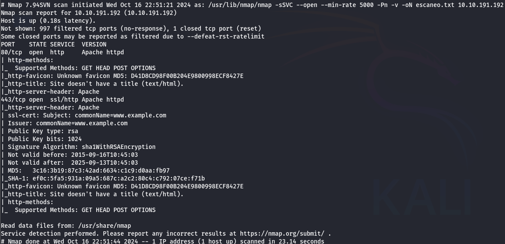

# 🎩 Mr. Robot

## Reconocimiento

Empezamos haciendo un escaneo de puertos con **Nmap**:

```bash
sudo nmap -sSVC --open --min-rate 5000 -Pn -v 10.10.191.192 -oN escaneo.txt
```

<figure><figcaption></figcaption></figure>

Analizando los resultados vemos que los puertos **80 HTTP** y **443 HTTPS** están abiertos.


Visitamos la página web y no topamos con una interfaz muy interesante

<figure><figcaption></figcaption></figure>

### Fuzzing web

Usamos **Gobuster** para encontrar directorios.

```bash
gobuster dir -u http://10.10.191.192 -w /usr/share/wordlists/SecLists/Discovery/Web-Content/common.txt
```

<figure><figcaption></figcaption></figure>

El fuzzing nos da muchos resultados de interés. En lo personal **/robots.txt** siempre es de las primeras rutas que me gusta revisar ya que nos puede dar información extra.

El archivo `robots.txt` reveló información útil.&#x20;

<figure><figcaption></figcaption></figure>

Nos encontramos con un archivo que al parecer contiene una lista de **contraseñas** o **usuarios.**

<figure><figcaption></figcaption></figure>

También encontramos con la ruta **/key-1-of-3.txt** donde encontramos la primer **flag.**

<figure><figcaption></figcaption></figure>

Después no movemos a la ruta **/wp-login,** en donde tratamos poner algunas de las credenciales típicas como admin:admin pero ninguna funciona.

<figure><figcaption></figcaption></figure>

### Fuerza bruta

Como no funcionó alguna de estas combinaciones, ahora intentaremos un **ataque de fuerza bruta.** Para esto usaremos **BurpSuite**, aunque tambien es posible hacerlo con **hydra.**

Primero interceptamos el login con el **proxy** y enviamos el **request** lo enviamos al **intruder** y ahí agregamos el marcador de payload al campo del usuario que es el que queremos encontrar.

<figure><figcaption></figcaption></figure>

Después entramos a la pestaña de **payloads** cargamos la lista (**fsocity.dic**) que habíamos descargado anteriormente en **/robots.txt,** una vez cargada el archivo damos clic en start attack.

<figure><figcaption></figcaption></figure>

En los resultados filtramos por **length,** encontrándonos con que el usuario **Elliot** es el único diferente y en la respuesta confirmamos que es un usuario correcto.

<figure><figcaption></figcaption></figure>

Ahora buscaremos alguna contraseña válida para esto también hay muchas herramientas que podemos utilizar, en este caso usaremos **wpscan** con el mismo diccionario descargad&#x6F;**.**

```bash
wpscan http://10.10.191.192/wp-login.php -U Elliot -P fsocity.dic
```

Dado que estaba tomando mucho tiempo en encontrando la contraseña, podemos aprovechar para explorar los otros directorios encontrados con Gobuster. Después de revisar un rato, en **/license** hallamos un texto en lo que parece **base64.**

<figure><figcaption></figcaption></figure>

Copiamos el texto y lo decodificamos:

```bash
echo "ZWxsaW90OkVSMjgtMDY1Mgo=" | base64 -d
```

Y al parecer tenemos la contraseña del usuario **elliot.**

<figure><figcaption></figcaption></figure>

Probamos las credenciales y listo logramos entrar sin tener que esperar a que wpscan termine. De igual forma si quieren encontrar la contraseña con fuerza bruta les recomiendo que empiecen por el final del diccionario **fsocity.**

<figure><figcaption></figcaption></figure>

## Explotación

Una vez encontrada la contraseña entramos al panel de administrador y hacemos un poco de exploración. En la pestaña **Appearance/Editor** podemos editar templates de código **PHP.**

<figure><figcaption></figcaption></figure>

En una de las plantillas , cargamos una **reverse shell** la cual conseguimos en [pentestmonkey](https://pentestmonkey.net/tools/web-shells/php-reverse-shell), solo editamos los campos de de **$ip** y **$port.**

<figure><figcaption></figcaption></figure>

Nos ponemos en escucha con `nc -lvnp 4444` y como la **reverse shell** la cargamos en la plantilla de 404, podemos poner cualquier cosa que llame este script.

<figure><figcaption></figcaption></figure>

Le damos un tratamiento a la terminal para que sea un poco más interactiva y nos dirigimos al directorio del usuario encontrado en **/home,** donde hay dos archivos un **txt** donde esta la **segunda flag,** en el otro archivo hay un **hash** que parece ser del usuario **robot.**

<figure><figcaption></figcaption></figure>

En esta [página](https://hashes.com/en/decrypt/hash) podemos descifrar el contenido de este hash.

<figure><figcaption></figcaption></figure>

Con la contraseña obtenida migramos al usuario **robot** y vemos el valor de la **segunda flag** dentro de **key-2-of-3.txt.**

<figure><figcaption></figcaption></figure>

## Escalada de privilegios

Para escalar privilegios, primero intentamos ejecutar el comando `sudo -l` pero el usario robot no puede ejecutar comandos **sudo,** por lo que procedemos a buscar archivos con privilegios **SUID.**

```bash
find / -perm -4000 2>/dev/null
```

Dentro de los archivos encontrados hay uno que esta fuera de lo común: **Nmap.**&#x20;

<figure><figcaption></figcaption></figure>

Haciendo una búsqueda por internet hallamos como podemos abusar de este archivo. Simplemente ejecutando:

```bash
nmap --interactive
!sh
```

obtenemos una **shell** como **root**, la **tercera flag** está dentro del directorio **/root.**

<figure><figcaption></figcaption></figure>

## Recomendaciones de Mitigación

1. **Enumeración de directorios**:
   * **Solución**: Deshabilitar o restringir el acceso a `/robots.txt` y archivos sensibles.
   * **Mejora**: Configurar reglas de firewall para evitar escaneos automatizados.
2. **Protección contra fuerza bruta**:
   * **Solución**: Implementar límites de intentos fallidos y **CAPTCHA** en formularios de login.
   * **Mejora**: Utilizar autenticación multifactor (MFA).
3. **Explotación de plugins vulnerables**:
   * **Solución**: Mantener los plugins y CMS siempre actualizados.
   * **Mejora**: Usar políticas de revisión antes de instalar nuevos plugins.
4. **Escalada de privilegios**:
   * **Solución**: Revisar y eliminar archivos con permisos **SUID** innecesarios para prevenir escaladas de privilegios.
   * **Mejora**: Implementar el principio de privilegio mínimo.
5. **Reverse shell**:
   * **Solución**: Monitorizar logs y conexiones sospechosas.
   * **Mejora**: Usar soluciones de detección de intrusiones (IDS) para identificar shells remotas.
